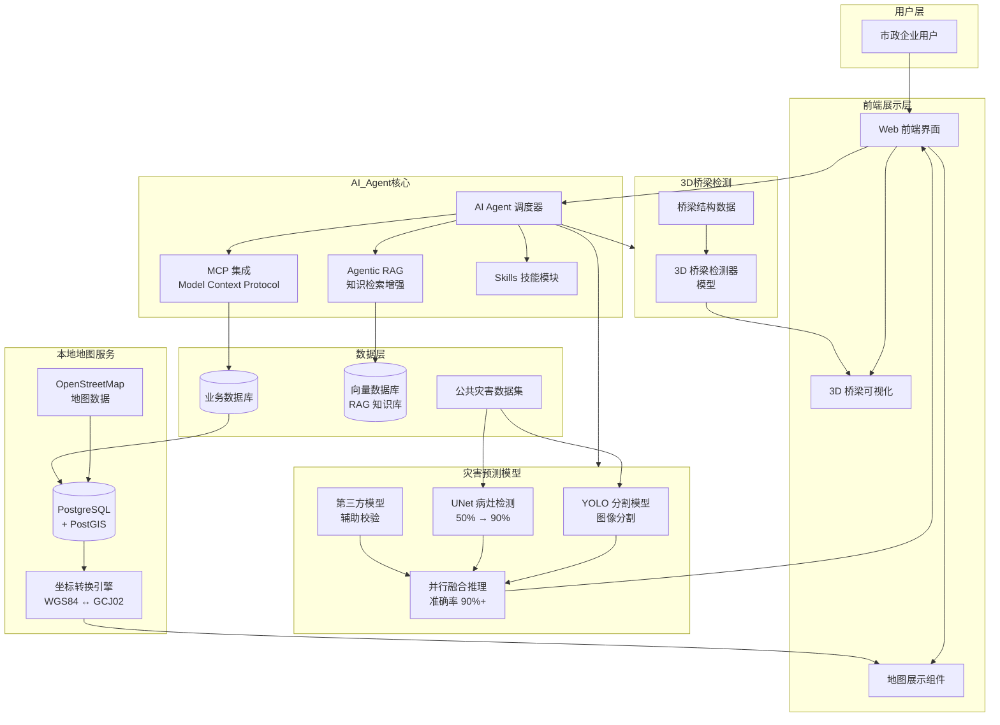
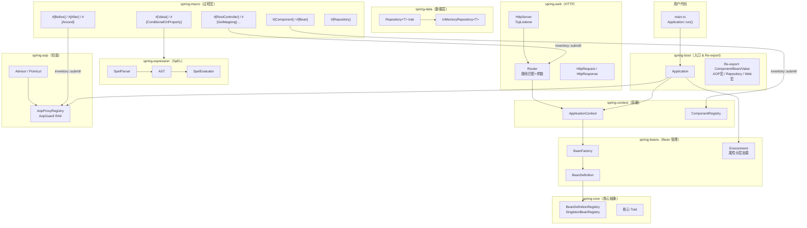

# AI 管养项目

## 背景
- 谁用: 市政企业
- 干什么: 对老系统进行优化,新增AI管养,灾害预测模型训练,地图本地部署,3D桥梁检测器模型搭建
- 已经上线

## 我干了什么

- 项目开始我就作为核心开发开始参与项目,先是和甲方对齐依赖然后和原开发人员对接系统功能
- 之后灾害模型训练交给我处理,使用公共数据集,模型准确率50%(Unet),之后想到yolo模型具备分割能力,然后第三方模型更准确,于是我采取了yolo模型进行分割,然后unet病灶和第三方模型并行的方式将准确率从从50%提升到了90%
- 然后客户说他们想将百度地图sdk修改为自己部署的地图工具,所以我将查询资料,通过openstreetmap的地图数据加PostgreSQL+PostGIS搭建了地图功能,在进行坐标转换后符合客户预期
- 之后AI agent核心开始开发,我参与了Agentic RAG,MCP集成,Skills等核心模块的编写

## 架构图:

# 志愿者管理系统

## 背景
- 谁用:重庆理工大学
- 干什么:对现在志愿者系统手工添加Excel表格等低效操作进行自动化管理

---

# rust-spring

## 背景
- 谁用：Rust 开发者、对 Spring 生态熟悉并希望在 Rust 中复用相同思维模式的工程师
- 干什么：用 Rust 复刻 Java Spring Framework 核心——注解驱动的 IoC 容器、依赖注入、AOP 切面、Spring Boot 风格自动配置、Spring Data 数据层抽象、Spring Web HTTP 服务，完整对标 Java Spring 生态，但只用过程宏注解，不支持 XML 配置
- 技术栈：Rust 2021 Edition、过程宏（proc-macro）、inventory（编译期 bean 注册）、std::net::TcpListener（HTTP 服务）

## 我干了什么

- 从零设计并实现了整个 Cargo Workspace，将 Spring 框架按职责拆分为 10 个独立 crate（spring-core、spring-beans、spring-context、spring-boot、spring-macro、spring-aop、spring-expression、spring-util、spring-data、spring-web），层次清晰、依赖单向
- 实现了 **IoC 容器核心**：`BeanDefinitionRegistry`、`BeanFactory`、`ApplicationContext`，支持 singleton 缓存、prototype 每次创建、懒加载（`#[Lazy]`），完整 bean 生命周期管理
- 编写了 **过程宏套件**（spring-macro）：`#[Component]`、`#[Bean]`、`#[Value]`、`#[Scope]`、`#[Lazy]`、`#[autowired]`、`#[ConditionalOnProperty]`，全部通过 `inventory::submit!` 在链接时注册，无运行时扫描开销
- 实现了 **SpEL 风格表达式引擎**（spring-expression）：手写 Parser → AST → Evaluator 全链路，支持算术/比较/逻辑运算、三元表达式、字符串方法（toUpperCase 等）、`${key:default}` 属性占位符，供 `#[Value("#{...}")]` 注解使用
- 实现了 **AOP 模块**（spring-aop）：`#[Aspect]`、`#[Before]`、`#[After]`、`#[Around]` 注解，基于 `inventory` 静态注册 Advisor，支持 `bean::method` 格式切点表达式，`AopGuard` RAII 结构体驱动 before/after/around 拦截
- 实现了 **环境分层加载**：`application.properties` 基础配置 → `application-{profile}.properties` Profile 覆盖 → `SPRING_PROP_*` 环境变量最高优先级，与 Java Spring 环境抽象一致
- 实现了 **Spring Data 抽象**（spring-data）：`Repository<T>` trait 定义标准 CRUD，`InMemoryRepository<T>` 基于 `RefCell<HashMap>` + 自增主键提供默认实现，`#[Repository]` 宏自动生成委托代码
- 实现了 **Spring Web**（spring-web）：基于 `std::net::TcpListener` 的轻量 HTTP/1.x 服务器，`#[RestController]`、`#[GetMapping]`、`#[PostMapping]` 等路由宏，支持路径参数 `{param}`，IoC 容器 bean 注入请求处理函数
- 编写了 **CLI 脚手架**（initializer）：一条命令生成开箱即用的 spring-boot 项目骨架（Cargo.toml + application.properties + main.rs 演示代码）
- 编写了完整示例（example）和迁移文档（docs/），降低 Java Spring 开发者的上手成本

## 架构图

## 核心注解对照表

| Java Spring | rust-spring | 说明 |
|---|---|---|
| `@Component` | `#[Component]` | 注册为受管 bean |
| `@Autowired` | `#[autowired]` | 字段依赖注入 |
| `@Bean` | `#[Bean]` | 函数式定义 bean |
| `@Value("${k:v}")` | `#[Value("${k:v}")]` | 配置值注入 |
| `@Scope("prototype")` | `#[Scope("prototype")]` | Prototype 作用域 |
| `@Lazy` | `#[Lazy]` | 懒加载 |
| `@Aspect` + `@Before` | `#[Aspect]` + `#[Before]` | AOP 前置通知 |
| `@Around` | `#[Around]` | AOP 环绕通知 |
| `@ConditionalOnProperty` | `#[ConditionalOnProperty]` | 条件注册 |
| `@RestController` | `#[RestController]` | HTTP 控制器 |
| `@GetMapping` | `#[GetMapping]` | GET 路由 |
| `SpringApplication.run()` | `Application::run()` | 应用启动 |
